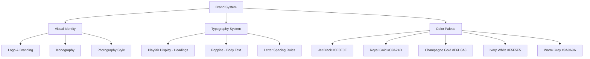
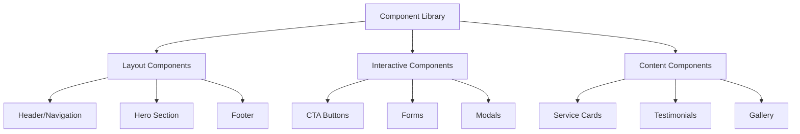
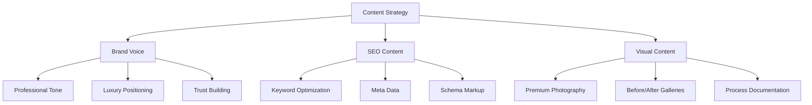

# Design Document: Luxe Wooden Furniture Polishing Rebrand

## Overview

This design outlines the complete transformation of the furniture polishing website from "A1 Furniture Polish" to "Luxe Wooden Furniture Polishing" with a luxury-focused design system, premium user experience, and comprehensive content strategy. The solution maintains SEO performance while elevating the brand to target high-end customers including luxury homes, villas, offices, and interior designers.

## Architecture

### Design System Architecture



### Component Architecture



### Content Management Architecture



## Components and Interfaces

### Brand System Component

**Purpose**: Centralized management of brand identity elements

**Interface**:
```typescript
interface BrandSystem {
  colors: {
    primary: '#0E0E0E';      // Jet Black
    accent: '#C9A24D';       // Royal Gold
    secondary: '#E6D3A3';    // Champagne Gold
    textPrimary: '#F5F5F5';  // Ivory White
    textSecondary: '#9A9A9A'; // Warm Grey
  };
  typography: {
    headings: 'Playfair Display';
    body: 'Poppins';
    letterSpacing: {
      headings: '0.02em';
      luxury: '0.1em';
    };
  };
  spacing: {
    section: '120px';
    component: '60px';
    element: '24px';
  };
}
```

### Hero Section Component

**Purpose**: Premium first impression with luxury positioning

**Interface**:
```typescript
interface HeroSection {
  title: {
    primary: 'LUXE';
    secondary: 'Wooden Furniture Polishing';
    tagline: 'Luxury Finish for Timeless Furniture';
  };
  cta: {
    primary: {
      text: 'Get a Free Inspection';
      style: 'solid-gold';
    };
    secondary: {
      text: 'View Our Work';
      style: 'outline-gold';
    };
  };
  background: {
    type: 'gradient-overlay';
    image: 'luxury-furniture-hero.jpg';
  };
}
```

### Navigation Component

**Purpose**: Elegant navigation maintaining luxury aesthetic

**Interface**:
```typescript
interface Navigation {
  logo: {
    text: 'Luxe Wooden Furniture Polishing';
    style: 'luxury-typography';
  };
  menu: {
    items: NavigationItem[];
    style: 'minimal-luxury';
    animations: 'subtle-hover';
  };
  mobile: {
    type: 'elegant-drawer';
    trigger: 'gold-hamburger';
  };
}
```

### Service Card Component

**Purpose**: Premium presentation of services

**Interface**:
```typescript
interface ServiceCard {
  title: string;
  description: string;
  image: {
    src: string;
    alt: string;
    style: 'luxury-overlay';
  };
  pricing: {
    display: 'premium-format';
    cta: 'gold-button';
  };
  hover: {
    animation: 'subtle-lift';
    overlay: 'gold-gradient';
  };
}
```

### Content Management System

**Purpose**: Consistent luxury content delivery

**Interface**:
```typescript
interface ContentManager {
  brandName: 'Luxe Wooden Furniture Polishing';
  tone: {
    style: 'professional-premium';
    sentenceLength: 'short-impactful';
    vocabulary: 'luxury-focused';
  };
  seo: {
    keywords: string[];
    metaTemplates: MetaTemplate[];
    schemaMarkup: SchemaType[];
  };
}
```

## Data Models

### Brand Configuration Model

```typescript
interface BrandConfig {
  name: 'Luxe Wooden Furniture Polishing';
  positioning: 'luxury-furniture-care';
  targetAudience: [
    'luxury-homes',
    'villas',
    'premium-apartments',
    'offices',
    'interior-designers'
  ];
  serviceAreas: string[];
  contactInfo: ContactDetails;
}
```

### Design Token Model

```typescript
interface DesignTokens {
  colors: ColorPalette;
  typography: TypographyScale;
  spacing: SpacingScale;
  shadows: ShadowScale;
  animations: AnimationConfig;
  breakpoints: ResponsiveBreakpoints;
}
```

### Content Template Model

```typescript
interface ContentTemplate {
  type: 'service' | 'location' | 'blog' | 'landing';
  brandElements: {
    name: string;
    tagline: string;
    cta: string[];
  };
  seoElements: {
    titleTemplate: string;
    metaDescription: string;
    keywords: string[];
  };
  contentStructure: ContentSection[];
}
```

### Asset Management Model

```typescript
interface AssetConfig {
  images: {
    hero: LuxuryImageSet;
    services: ServiceImageSet;
    gallery: GalleryImageSet;
    testimonials: TestimonialImageSet;
  };
  optimization: {
    formats: ['webp', 'avif', 'jpg'];
    sizes: ResponsiveSizes;
    quality: 'premium';
  };
  naming: {
    convention: 'luxe-[category]-[description]';
    prefix: 'luxe-';
  };
}
```

## Correctness Properties

*A property is a characteristic or behavior that should hold true across all valid executions of a system-essentially, a formal statement about what the system should do. Properties serve as the bridge between human-readable specifications and machine-verifiable correctness guarantees.*

### Property 1: Brand Name Consistency
*For any* page or component on the website, all brand references should consistently display "Luxe Wooden Furniture Polishing" and never show the old "A1 Furniture Polish" branding
**Validates: Requirements 1.1, 8.1**

### Property 2: Color Palette Compliance
*For any* visual element on the website, colors used should only come from the defined luxury palette (Jet Black #0E0E0E, Royal Gold #C9A24D, Champagne Gold #E6D3A3, Ivory White #F5F5F5, Warm Grey #9A9A9A)
**Validates: Requirements 1.2, 5.4**

### Property 3: Typography System Consistency
*For any* text element, headings should use Playfair Display with proper letter spacing and body text should use Poppins font
**Validates: Requirements 1.3, 1.4**

### Property 4: Hover Animation Functionality
*For any* interactive element, hovering should trigger subtle animations and visual feedback
**Validates: Requirements 2.2, 6.3**

### Property 5: Text Contrast Standards
*For any* text element, the contrast ratio between text and background should meet high contrast requirements for readability
**Validates: Requirements 2.3**

### Property 6: Responsive Design Consistency
*For any* screen size or device, all components should render correctly and maintain luxury styling with mobile-first responsive design
**Validates: Requirements 2.5, 6.4**

### Property 7: CTA Text Consistency
*For any* call-to-action button, primary CTAs should display "Get a Free Inspection" and secondary CTAs should display "View Our Work"
**Validates: Requirements 3.5, 7.1, 7.2**

### Property 8: SEO Keyword Integration
*For any* page with SEO optimization, titles and meta descriptions should contain luxury furniture polishing keywords
**Validates: Requirements 4.1, 4.5**

### Property 9: URL Structure Cleanliness
*For any* page URL, the structure should be clean, follow brand naming conventions, and not contain old brand references
**Validates: Requirements 4.2**

### Property 10: Page Loading Performance
*For any* page on the website, loading time should be optimized for fast performance
**Validates: Requirements 4.3, 5.5**

### Property 11: Schema Markup Validity
*For any* page with structured data, schema markup should be valid and contain the new business name
**Validates: Requirements 4.4, 8.5**

### Property 12: Logo Brand Consistency
*For any* logo display, it should show the new "Luxe Wooden Furniture Polishing" branding
**Validates: Requirements 5.2**

### Property 13: Smooth Scrolling Implementation
*For any* page with scrollable content, smooth scrolling behavior should be enabled
**Validates: Requirements 6.1**

### Property 14: Navigation Design Consistency
*For any* navigation element, styling should be consistent across pages and use luxury design elements
**Validates: Requirements 6.2**

### Property 15: URL Redirect Functionality
*For any* old A1 Furniture Polish URL, it should properly redirect to the corresponding new Luxe branded URL
**Validates: Requirements 8.2**

### Property 16: Asset Naming Convention
*For any* media file or asset, the filename should follow the "luxe-[category]-[description]" naming convention
**Validates: Requirements 8.3**

### Property 17: Internal Link Validity
*For any* internal link on the website, it should point to a valid new URL and not contain old brand references
**Validates: Requirements 8.4**

## Error Handling

### Brand Inconsistency Detection
- Implement automated checks for old brand name references
- Validate color usage against defined palette
- Monitor typography compliance across components

### SEO Migration Safety
- Implement proper 301 redirects for all URL changes
- Monitor search ranking impacts during transition
- Validate schema markup for new brand information

### Asset Management Errors
- Handle missing luxury images gracefully with branded placeholders
- Implement fallback fonts if custom fonts fail to load
- Ensure responsive images work across all devices

### Content Quality Assurance
- Validate content tone against luxury brand guidelines
- Check for consistent messaging across all pages
- Ensure all CTAs use approved luxury language

## Testing Strategy

### Visual Regression Testing
- Screenshot comparison tests for all major components
- Color palette validation across different browsers
- Typography rendering consistency checks

### Brand Compliance Testing
- Automated scanning for old brand name references
- Validation of luxury design standards implementation
- Consistency checks across all page templates

### SEO Performance Testing
- Monitor keyword ranking changes during migration
- Validate meta data and schema markup updates
- Test page loading speeds with new luxury assets

### User Experience Testing
- Mobile responsiveness across luxury design elements
- Smooth scrolling and animation performance
- CTA button functionality and styling validation

### Content Quality Testing
- Tone and messaging consistency validation
- Luxury positioning effectiveness measurement
- Trust-building element presence verification

**Dual Testing Approach**:
- **Unit tests**: Verify specific brand elements, color usage, and component functionality
- **Property tests**: Verify universal brand consistency and luxury design standards across all inputs
- Both approaches ensure comprehensive coverage of the luxury rebrand requirements