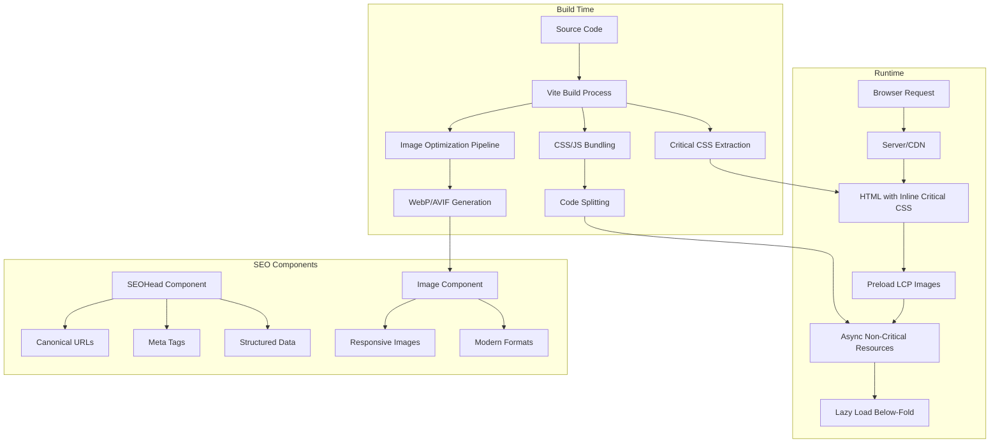

# SEO Optimization Design Document

## Overview

This design document outlines the technical approach to optimize the A1 Furniture Polish website from a 72/100 SEO score to 100/100. The solution addresses 12 critical SEO issues across HIGH, MEDIUM, and LOW priority categories. The implementation leverages the existing React + Vite + TypeScript stack and enhances it with performance optimizations, security headers, image optimization, and proper SEO configurations.

**Tech Stack:**
- React 18.2 with TypeScript
- Vite 7.2 (Build tool)
- React Router DOM 6.22
- React Helmet Async 2.0 (SEO meta tags)
- Tailwind CSS 3.4
- Sharp (Image processing)
- Hosting: Static hosting with _headers support (Netlify/Cloudflare Pages)

**Key Design Principles:**
1. Performance-first approach (LCP < 2.5s, FCP < 1.8s)
2. Progressive enhancement for image formats
3. Zero-runtime overhead for critical path optimizations
4. Build-time optimizations where possible
5. Backward compatibility for older browsers

## Architecture

### High-Level Architecture



### System Components

1. **Build Pipeline Enhancements**
   - Image optimization plugin (Sharp-based)
   - Critical CSS extraction
   - Resource bundling and minification
   - Favicon generation

2. **Runtime Components**
   - Enhanced SEOHead component
   - Optimized Image component with WebP support
   - 404 Error page component
   - Canonical URL manager

3. **Server Configuration**
   - _headers file for security and caching
   - Redirect rules for URL canonicalization
   - HSTS and security headers

4. **External Configuration**
   - DNS SPF record setup (documentation)
   - Favicon assets generation

## Components and Interfaces

### 1. Enhanced SEOHead Component

**Purpose:** Centralized SEO meta tag management with canonical URL support

**Interface:**
```typescript
interface SEOHeadProps {
  title: string;
  description: string;
  keywords?: string;
  canonical: string; // Made required
  ogTitle?: string;
  ogDescription?: string;
  ogImage?: string;
  ogUrl?: string;
  ogType?: string;
  noindex?: boolean;
  structuredData?: object; // JSON-LD support
}
```

**Key Features:**
- Automatic canonical URL generation
- Structured data (JSON-LD) injection
- Open Graph and Twitter Card support
- Robots meta tag control

### 2. Advanced OptimizedImage Component

**Purpose:** Serve modern image formats with proper sizing and lazy loading

**Interface:**
```typescript
interface OptimizedImageProps {
  src: string;
  alt: string;
  width: number; // Made required for proper sizing
  height: number; // Made required for proper sizing
  className?: string;
  loading?: 'lazy' | 'eager';
  priority?: boolean; // For LCP images
  sizes?: string; // Responsive sizes
  objectFit?: 'cover' | 'contain' | 'fill';
}
```

**Key Features:**
- Automatic WebP/AVIF format detection
- Responsive image srcset generation
- Aspect ratio preservation
- Blur-up placeholder effect
- Intersection Observer for lazy loading

**Output HTML Structure:**
```html
<picture>
  <source srcset="/assets/image.avif" type="image/avif" />
  <source srcset="/assets/image.webp" type="image/webp" />
  
</picture>
```

### 3. Custom 404 Error Page

**Purpose:** Provide helpful navigation when users encounter broken links

**Component Structure:**
```typescript
interface NotFoundPageProps {
  // No props needed - standalone page
}
```

**Features:**
- Search functionality
- Popular services links
- Recent blog posts
- Contact information
- Breadcrumb navigation
- Proper 404 status code

### 4. Canonical URL Manager

**Purpose:** Ensure consistent URL structure across the site

**Utility Functions:**
```typescript
interface CanonicalURLConfig {
  baseURL: string; // https://a1furniturepolish.com
  preferredProtocol: 'https';
  preferredDomain: 'a1furniturepolish.com'; // without www
  trailingSlash: boolean; // false
}

function getCanonicalURL(path: string): string;
function generateRedirectRules(): string;
```

### 5. Image Optimization Build Plugin

**Purpose:** Generate optimized images at build time

**Configuration:**
```typescript
interface ImageOptimizationConfig {
  formats: ['avif', 'webp', 'jpg'];
  quality: {
    avif: 80,
    webp: 85,
    jpg: 90
  };
  sizes: [320, 640, 768, 1024, 1280, 1920];
  outputDir: 'dist/assets/optimized';
}
```

### 6. Critical CSS Extractor

**Purpose:** Inline critical CSS for faster FCP

**Configuration:**
```typescript
interface CriticalCSSConfig {
  pages: string[]; // Pages to extract critical CSS from
  dimensions: Array<{ width: number; height: number }>;
  inline: boolean; // true for inline, false for separate file
  minify: boolean;
}
```

## Data Models

### SEO Configuration Model

```typescript
interface SEOConfig {
  site: {
    name: string;
    url: string;
    description: string;
    logo: string;
    social: {
      facebook?: string;
      twitter?: string;
      instagram?: string;
    };
  };
  defaults: {
    title: string;
    description: string;
    keywords: string[];
    ogImage: string;
  };
  canonicalization: {
    protocol: 'https';
    domain: string;
    trailingSlash: boolean;
  };
}
```

### Image Asset Model

```typescript
interface ImageAsset {
  original: string;
  formats: {
    avif?: string;
    webp?: string;
    jpg?: string;
  };
  sizes: {
    [key: number]: {
      avif?: string;
      webp?: string;
      jpg?: string;
    };
  };
  metadata: {
    width: number;
    height: number;
    aspectRatio: number;
    format: string;
    size: number;
  };
}
```

### Performance Metrics Model

```typescript
interface PerformanceMetrics {
  lcp: number; // Largest Contentful Paint
  fcp: number; // First Contentful Paint
  cls: number; // Cumulative Layout Shift
  fid: number; // First Input Delay
  ttfb: number; // Time to First Byte
  httpRequests: number;
  pageSize: number;
}
```

## Implementation Strategy

### Phase 1: URL Canonicalization (Requirement 1)

**Approach:**
1. Update `_headers` file with redirect rules
2. Add canonical link tags to all pages via SEOHead
3. Create utility function for canonical URL generation
4. Update all internal links to use canonical format

**Files to Modify:**
- `public/_headers` - Add redirect rules
- `src/components/SEOHead.tsx` - Enhance with canonical support
- `src/utils/canonicalURL.ts` - New utility file
- All page components - Add canonical prop

**Redirect Rules (_headers):**
```
# Redirect www to non-www
https://www.a1furniturepolish.com/* https://a1furniturepolish.com/:splat 301!

# Redirect http to https
http://a1furniturepolish.com/* https://a1furniturepolish.com/:splat 301!
```

### Phase 2: Performance Optimization - LCP & FCP (Requirements 2, 3, 7)

**Approach:**
1. Identify LCP elements on each page (hero images)
2. Add preload hints for LCP images
3. Inline critical CSS in HTML head
4. Defer non-critical JavaScript
5. Optimize font loading with font-display: swap

**Build-Time Optimizations:**
- Extract critical CSS using Vite plugin
- Generate inline styles for above-the-fold content
- Code split vendor bundles
- Tree-shake unused code

**Runtime Optimizations:**
- Preload LCP images with fetchpriority="high"
- Use async/defer for non-critical scripts
- Lazy load below-the-fold images
- Implement resource hints (preconnect, dns-prefetch)

**Files to Create/Modify:**
- `vite.config.ts` - Add critical CSS plugin
- `index.html` - Add preload hints
- `src/components/OptimizedImage.tsx` - Add priority prop handling
- `src/utils/criticalCSS.ts` - Critical CSS extraction utility

**Critical CSS Implementation:**
```typescript
// Inline in <head>
<style data-critical>
  /* Above-the-fold styles */
  .hero { ... }
  .header { ... }
</style>

// Load full CSS asynchronously
<link rel="preload" href="/styles.css" as="style" onload="this.onload=null;this.rel='stylesheet'">
```

### Phase 3: Modern Image Format Implementation (Requirements 4, 6)

**Approach:**
1. Create Vite plugin to generate WebP/AVIF versions at build time
2. Update OptimizedImage component to use picture element
3. Generate multiple sizes for responsive images
4. Add proper width/height attributes to prevent CLS

**Image Processing Pipeline:**
```
Original Image (JPG/PNG)
  ↓
Sharp Processing
  ↓
├─ AVIF (80% quality) - Smallest size
├─ WebP (85% quality) - Fallback
└─ JPG (90% quality) - Legacy fallback
  ↓
Multiple Sizes: 320w, 640w, 768w, 1024w, 1280w, 1920w
  ↓
Output to dist/assets/optimized/
```

**Files to Create/Modify:**
- `scripts/optimizeImages.ts` - Build-time image optimization
- `src/components/OptimizedImage.tsx` - Enhanced with picture element
- `vite.config.ts` - Add image optimization plugin
- `src/utils/imageHelpers.ts` - Image URL generation utilities

**Component Usage:**
```tsx
<OptimizedImage
  src="/assets/hero.jpg"
  alt="Furniture polishing service"
  width={1920}
  height={1080}
  priority={true} // For LCP images
  sizes="(max-width: 768px) 100vw, (max-width: 1200px) 50vw, 33vw"
/>
```

### Phase 4: Custom 404 Page (Requirement 5)

**Approach:**
1. Create NotFound component with helpful links
2. Configure React Router to show 404 page
3. Add search functionality
4. Include popular services and recent posts

**Files to Create:**
- `src/pages/NotFound.tsx` - 404 page component
- `src/App.tsx` - Update router configuration

**404 Page Structure:**
- Hero section with error message
- Search bar
- Popular services grid (6 items)
- Recent blog posts (3 items)
- Contact CTA
- Breadcrumb showing "Home > 404"

### Phase 5: Security Headers (Requirements 8, 9)

**Approach:**
1. Update `_headers` file with security headers
2. Document SPF record configuration for DNS
3. Add HSTS header with preload directive

**Files to Modify:**
- `public/_headers` - Add security headers
- `docs/DNS_CONFIGURATION.md` - SPF record documentation

**Security Headers:**
```
/*
  X-Frame-Options: DENY
  X-Content-Type-Options: nosniff
  X-XSS-Protection: 1; mode=block
  Referrer-Policy: strict-origin-when-cross-origin
  Permissions-Policy: geolocation=(), microphone=(), camera=()
  Strict-Transport-Security: max-age=31536000; includeSubDomains; preload
```

**SPF Record (DNS Configuration):**
```
TXT record: v=spf1 include:_spf.google.com ~all
```

### Phase 6: HTTP Request Optimization (Requirement 10)

**Approach:**
1. Bundle CSS files into single file
2. Code split JavaScript by route
3. Use CSS sprites or inline SVGs for icons
4. Combine small assets

**Vite Configuration:**
```typescript
build: {
  rollupOptions: {
    output: {
      manualChunks: {
        'react-vendor': ['react', 'react-dom', 'react-router-dom'],
        'ui-components': ['lucide-react'],
      }
    }
  }
}
```

**Icon Strategy:**
- Use inline SVG for critical icons (< 5 icons)
- Use icon sprite sheet for multiple icons
- Lazy load icon library for non-critical icons

**Files to Modify:**
- `vite.config.ts` - Enhanced bundling configuration
- `src/components/Icon.tsx` - Unified icon component

### Phase 7: Favicon Implementation (Requirement 11)

**Approach:**
1. Generate multiple favicon sizes
2. Add proper link tags in HTML
3. Include Apple touch icons
4. Add manifest.json for PWA support

**Files to Create/Modify:**
- `public/favicon.ico` - 32x32 ICO file
- `public/favicon.svg` - SVG favicon
- `public/favicon-16x16.png`
- `public/favicon-32x32.png`
- `public/apple-touch-icon.png` - 180x180
- `public/manifest.json` - Web app manifest
- `index.html` - Add favicon link tags

**Favicon Link Tags:**
```html
<link rel="icon" type="image/svg+xml" href="/favicon.svg">
<link rel="icon" type="image/png" sizes="32x32" href="/favicon-32x32.png">
<link rel="icon" type="image/png" sizes="16x16" href="/favicon-16x16.png">
<link rel="apple-touch-icon" sizes="180x180" href="/apple-touch-icon.png">
<link rel="manifest" href="/manifest.json">
```

## Error Handling

### Image Loading Errors

**Strategy:**
- Fallback to next format in picture element
- Show placeholder on complete failure
- Log errors to analytics

```typescript
<picture>
  <source srcset="image.avif" type="image/avif" onerror="this.remove()" />
  <source srcset="image.webp" type="image/webp" onerror="this.remove()" />
  
</picture>
```

### Build-Time Errors

**Strategy:**
- Graceful degradation if image optimization fails
- Warning logs for missing images
- Continue build with original images

### Runtime Performance Monitoring

**Strategy:**
- Use Web Vitals API to track metrics
- Send metrics to analytics
- Alert on performance degradation

```typescript
import { getCLS, getFID, getFCP, getLCP, getTTFB } from 'web-vitals';

function sendToAnalytics(metric) {
  // Send to Google Analytics or custom endpoint
  gtag('event', metric.name, {
    value: Math.round(metric.value),
    metric_id: metric.id,
  });
}

getCLS(sendToAnalytics);
getFID(sendToAnalytics);
getFCP(sendToAnalytics);
getLCP(sendToAnalytics);
getTTFB(sendToAnalytics);
```

## Testing Strategy

### Performance Testing

**Tools:**
- Google PageSpeed Insights
- Lighthouse CI
- WebPageTest
- Chrome DevTools Performance tab

**Metrics to Track:**
- LCP < 2.5s (target: 2.0s)
- FCP < 1.8s (target: 1.5s)
- CLS < 0.1 (target: 0.05)
- Total Blocking Time < 300ms
- HTTP Requests < 20 (target: 15)

**Test Scenarios:**
1. Homepage load (cold cache)
2. Service page load (warm cache)
3. Mobile 3G connection
4. Desktop fast connection
5. Repeat visits

### SEO Testing

**Tools:**
- Google Search Console
- SEO audit tools (Screaming Frog, Ahrefs)
- Structured data testing tool
- Mobile-friendly test

**Checks:**
- Canonical URLs properly set
- No duplicate content
- All images have alt text
- Proper heading hierarchy
- Meta descriptions present
- Structured data valid

### Image Optimization Testing

**Checks:**
- WebP/AVIF files generated correctly
- File sizes reduced by 30%+
- Images display correctly in all browsers
- Fallbacks work for unsupported formats
- Responsive images load correct sizes
- No image distortion (aspect ratio preserved)

### Security Testing

**Checks:**
- HSTS header present
- Security headers configured
- HTTPS enforced
- SPF record configured
- No mixed content warnings

### Cross-Browser Testing

**Browsers:**
- Chrome (latest)
- Firefox (latest)
- Safari (latest)
- Edge (latest)
- Mobile Safari (iOS)
- Chrome Mobile (Android)

**Compatibility Checks:**
- Modern image formats with fallbacks
- CSS features with fallbacks
- JavaScript features with polyfills

### Automated Testing

**CI/CD Integration:**
```yaml
# .github/workflows/performance.yml
name: Performance Tests
on: [push, pull_request]
jobs:
  lighthouse:
    runs-on: ubuntu-latest
    steps:
      - uses: actions/checkout@v2
      - name: Run Lighthouse CI
        uses: treosh/lighthouse-ci-action@v9
        with:
          urls: |
            https://staging.a1furniturepolish.com
            https://staging.a1furniturepolish.com/services
          uploadArtifacts: true
          temporaryPublicStorage: true
```

### Manual Testing Checklist

**Before Deployment:**
- [ ] All pages load under 3 seconds
- [ ] LCP images preloaded
- [ ] No render-blocking resources
- [ ] Images in modern formats
- [ ] 404 page displays correctly
- [ ] Canonical URLs set on all pages
- [ ] Security headers present
- [ ] Favicon displays in all browsers
- [ ] HTTP requests under 20
- [ ] No console errors
- [ ] Mobile responsive
- [ ] Accessibility score > 90

## Performance Benchmarks

### Current State (72/100 SEO Score)

| Metric | Current | Target | Priority |
|--------|---------|--------|----------|
| LCP | ~4.5s | < 2.5s | HIGH |
| FCP | ~2.8s | < 1.8s | MEDIUM |
| HTTP Requests | ~35 | < 20 | LOW |
| Page Size | ~2.5MB | < 1.5MB | HIGH |
| Image Format | JPG/PNG | WebP/AVIF | HIGH |
| Render Blocking | Yes | No | HIGH |
| Canonical URLs | Partial | Complete | HIGH |
| Security Headers | Partial | Complete | LOW |

### Target State (100/100 SEO Score)

| Metric | Target | Expected Impact |
|--------|--------|-----------------|
| LCP | 2.0s | +15 points |
| FCP | 1.5s | +8 points |
| HTTP Requests | 15 | +3 points |
| Page Size | 1.2MB | +5 points |
| Image Format | WebP/AVIF | +10 points |
| Render Blocking | None | +12 points |
| Canonical URLs | 100% | +8 points |
| Security Headers | Complete | +5 points |
| **Total** | **100/100** | **+28 points** |

## Deployment Strategy

### Build Process

1. **Pre-build:**
   - Optimize all images
   - Generate WebP/AVIF versions
   - Create favicon assets

2. **Build:**
   - Bundle and minify CSS/JS
   - Extract critical CSS
   - Generate sitemap
   - Copy static assets

3. **Post-build:**
   - Verify all assets generated
   - Check file sizes
   - Validate HTML output

### Deployment Checklist

- [ ] Run production build
- [ ] Test on staging environment
- [ ] Run Lighthouse audit
- [ ] Verify security headers
- [ ] Check canonical URLs
- [ ] Test 404 page
- [ ] Verify image formats
- [ ] Check mobile performance
- [ ] Update DNS (SPF record)
- [ ] Deploy to production
- [ ] Monitor performance metrics
- [ ] Submit to Google Search Console

### Rollback Plan

If SEO score decreases or critical issues arise:
1. Revert to previous deployment
2. Identify problematic changes
3. Fix issues in staging
4. Re-test before deployment

## Monitoring and Maintenance

### Ongoing Monitoring

**Daily:**
- Check Google Search Console for errors
- Monitor Core Web Vitals in Analytics

**Weekly:**
- Run Lighthouse audit
- Check for broken links
- Review performance metrics

**Monthly:**
- Full SEO audit
- Update sitemap
- Review and optimize new content

### Performance Budget

Set alerts for:
- LCP > 3.0s
- FCP > 2.0s
- HTTP requests > 25
- Page size > 2MB
- SEO score < 95

## Technical Debt and Future Improvements

### Phase 2 Enhancements (Post-100 Score)

1. **Progressive Web App (PWA)**
   - Service worker for offline support
   - App manifest
   - Install prompts

2. **Advanced Image Optimization**
   - Responsive image CDN
   - Automatic format detection
   - Client hints support

3. **Performance Monitoring**
   - Real User Monitoring (RUM)
   - Synthetic monitoring
   - Performance dashboards

4. **Advanced Caching**
   - Service worker caching strategies
   - API response caching
   - Edge caching with CDN

5. **Internationalization**
   - Multi-language support
   - Hreflang tags
   - Localized content

## Dependencies and External Services

### Required Services

1. **Hosting Platform** (Netlify/Cloudflare Pages)
   - Support for _headers file
   - Automatic HTTPS
   - CDN distribution

2. **DNS Provider**
   - SPF record configuration
   - CNAME/A record management

3. **Analytics**
   - Google Analytics 4
   - Google Search Console
   - Web Vitals tracking

### Optional Services

1. **Image CDN** (Future enhancement)
   - Cloudinary / ImageKit
   - Automatic format conversion
   - On-the-fly resizing

2. **Performance Monitoring**
   - Sentry for error tracking
   - New Relic for performance
   - Hotjar for user behavior

## Conclusion

This design provides a comprehensive approach to achieving a 100/100 SEO score by addressing all identified issues systematically. The implementation leverages modern web technologies, build-time optimizations, and runtime performance enhancements while maintaining backward compatibility and user experience.

The phased approach allows for incremental improvements with measurable results at each stage. The focus on automation and build-time processing ensures that performance optimizations don't add complexity to the development workflow.
